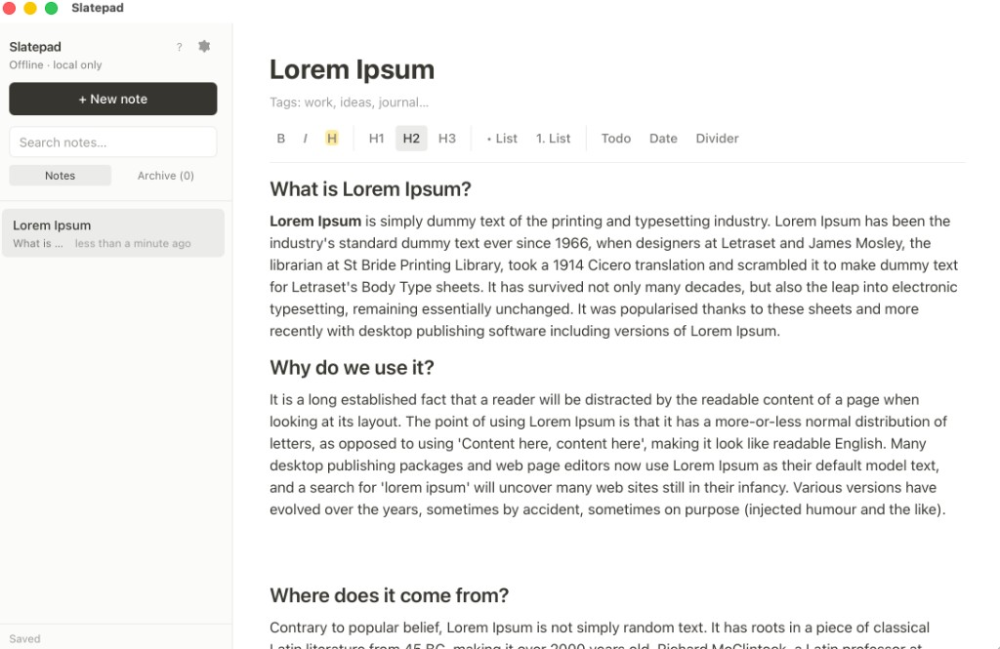

# Slatepad

**Local-first offline notes** — a desktop app inspired by Notion and AFFiNE. Your notes live in SQLite on your machine: no accounts, no sync, no network calls.



## Features

### Notes
- Sidebar with search, pinned notes, and tags
- Archive (soft delete) with restore and empty archive
- Auto-save to local SQLite (~500ms debounce)
- Duplicate note and copy note as Markdown

### Editor
- Rich text: bold, italic, strikethrough, headings, lists
- Todo lists with checkboxes, quotes, code blocks, links, dividers
- Insert today's date or timestamp
- **`/` slash menu** for quick blocks
- **Bubble menu** on text selection (B, I, strike, link, code)

### Shortcuts
| Shortcut | Action |
|----------|--------|
| `⌘/Ctrl N` | New note |
| `⌘/Ctrl K` | Quick switcher (jump to note) |
| `⌘/Ctrl Backspace` | Archive note |
| `/` | Slash commands in editor |
| `?` | Keyboard shortcuts help |

### Appearance
- Light / dark mode (saved locally)

## Tech stack

- [Tauri 2](https://tauri.app/) — native shell
- React 19 + TypeScript + Vite
- Tailwind CSS 4
- [TipTap](https://tiptap.dev/) — rich text editor
- SQLite via [`tauri-plugin-sql`](https://github.com/tauri-apps/plugins-workspace)

## Prerequisites

- [Node.js](https://nodejs.org/) 20+
- [Rust](https://www.rust-lang.org/tools/install) (for Tauri)
- [Tauri prerequisites](https://tauri.app/start/prerequisites/) for your OS

## Development setup

```bash
git clone https://github.com/yasharma/Slatepad.git
cd Slatepad
npm install
source "$HOME/.cargo/env"   # if Rust is not on PATH
npm run tauri dev
```

For frontend-only work (no Tauri window), you can run `npm run dev`.

## Build for production

```bash
npm run build          # web assets
npm run tauri build    # platform installer / bundle
```

Artifacts are written under `src-tauri/target/release/` (exact paths depend on OS).

## Data location

Notes are stored in **`notes.db`** (SQLite):

| OS | Path |
|----|------|
| macOS | `~/Library/Application Support/com.ysharma.slatepad/notes.db` |

**Upgrading from local-plus:** the app identifier changed from `com.ysharma.local-plus` to `com.ysharma.slatepad`, so macOS treats this as a new app. Your old database remains at `~/Library/Application Support/com.ysharma.local-plus/notes.db` but is **not** migrated automatically — copy `notes.db` into the new folder if you want to keep existing notes.

Theme preferences in the webview are migrated automatically from `local-plus-theme` to `slatepad-theme` in localStorage.

## License

This project is licensed under the [MIT License](LICENSE).

## Contributing

Contributions are welcome. For a short checklist, see [CONTRIBUTING.md](CONTRIBUTING.md).

1. **Fork** the repository on GitHub.
2. **Clone** your fork and create a branch: `git checkout -b your-feature`.
3. **Install and run**: `npm install`, then `npm run tauri dev`.
4. **Make changes**, keep the diff focused on the feature or fix.
5. **Verify**: `npm run build` (and `npm run tauri build` if you touched Rust or Tauri config).
6. **Open a pull request** against `main` with a clear description and test notes.

**Guidelines:** match existing code style, avoid drive-by refactors, and do not commit secrets or local databases (`notes.db`).
